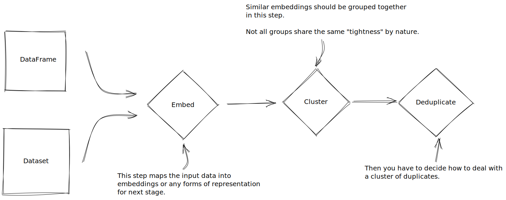

# text-dedup

[](https://www.codacy.com/gh/ChenghaoMou/text-dedup/dashboard?utm_source=github.com&utm_medium=referral&utm_content=ChenghaoMou/text-dedup&utm_campaign=Badge_Coverage) [](https://www.codacy.com/gh/ChenghaoMou/text-dedup/dashboard?utm_source=github.com&utm_medium=referral&utm_content=ChenghaoMou/text-dedup&utm_campaign=Badge_Grade)

<div align="center" style="display:flex;flex-direction:column;">
  
</div>

## Features

-   Support hash-based embeddings (MinHash + LSH, SimHash), `transformers` embeddings, and suffix array from [Deduplicating Training Data Makes Language Models Better](https://arxiv.org/abs/2107.06499).
-   Support both near-deduplication, semantic deduplication, and substring exact deduplication.

## Usage

More examples can be found in `examples`.

### Find Duplicates for any dataset on Huggingface's datasets

```text
Usage: cli.py [OPTIONS] COMMAND [ARGS]...

Options:
  --install-completion  Install completion for the current shell.
  --show-completion     Show completion for the current shell, to copy it or
                        customize the installation.
  --help                Show this message and exit.

Commands:
  minhash-dedup
  simhash-dedup
  suffix-dedup
```

### Hash-based Near Deduplication
```python
from text_dedup.embedders.minhash import MinHashEmbedder
from text_dedup.utils.nn import lsh_clustering
from text_dedup.utils.group import get_group_indices

if __name__ == "__main__":

    corpus = [
        "The quick brown fox jumps over the lazy dog",
        "The quick brown fox jumps over the lazy dog",
        "This is a test",
        "This is a test",
    ]

    embedder = MinHashEmbedder()
    embeddings = embedder.embed(corpus)

    clusters = lsh_clustering(embeddings)
    groups = get_group_indices(clusters)
    print(groups)
    # [0, 0, 2, 2]
```

```python
from text_dedup.embedders.simhash import SimHashEmbedder
from text_dedup.utils.nn import simhash_clustering
from text_dedup.utils.group import get_group_indices

if __name__ == "__main__":

    corpus = [
        "The quick brown fox jumps over the lazy dog",
        "The quick brown fox jumps over the lazy dog",
        "This is a test",
        "This is a test",
    ]

    embedder = SimHashEmbedder()
    embeddings = embedder.embed(corpus)

    clusters = simhash_clustering(embeddings)
    groups = get_group_indices(clusters)
    print(groups)
    # [0, 0, 2, 2]
```

### Suffix Array Substring Exact Deduplication

```python
from text_dedup.embedders.suffix import SuffixArrayEmbedder

if __name__ == "__main__":

    corpus = [
        "The quick brown fox jumps over the lazy dog",
        "The quick brown fox jumps over the lazy dog",
        "This is a test",
        "This is a test",
        "This is a random test",
        "The quick brown fox and a random test"
    ]


    embedder = SuffixArrayEmbedder(k=10)
    slices = embedder.embed(corpus, merge=True, merge_strategy='longest')
    # or using the original rust code
    # slices = embedder.embed_bash(corpus)

    for sentence, intervals in zip(corpus, slices):
        print(sentence)
        print([sentence[slice] for slice in intervals])
    # The quick brown fox jumps over the lazy dog
    # ['The quick brown fox jumps over the lazy dog']
    # The quick brown fox jumps over the lazy dog
    # ['The quick brown fox jumps over the lazy dog']
    # This is a test
    # ['This is a test']
    # This is a test
    # ['This is a test']
    # This is a random test
    # ['This is a ', ' a random test']
    # The quick brown fox and a random test
    # ['The quick brown fox ', ' a random test']
```

### Transformer Embedding Semantic Deduplication

```python
from text_dedup.embedders.transformer import TransformerEmbedder
from text_dedup.utils.nn import annoy_clustering
from text_dedup.utils.group import get_group_indices

if __name__ == "__main__":

    from transformers import AutoTokenizer, AutoModelForSequenceClassification
    corpus = [
        "The quick brown fox jumps over the dog",
        "The quick brown fox jumps over the corgi",
        "This is a test",
        "This is a test message",
    ]

    tokenizer = AutoTokenizer.from_pretrained("bert-base-uncased")
    model = AutoModelForSequenceClassification.from_pretrained("bert-base-uncased")

    embedder = TransformerEmbedder(tokenizer, model)
    embeddings = embedder.embed(corpus)

    clusters = annoy_clustering(embeddings, f=768)
    groups = get_group_indices(clusters)
    print(groups)
    # [0, 0, 2, 2]
```
